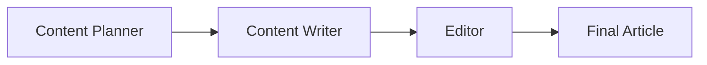

# 🤖 Multi AI Agent Systems with CrewAI

[](https://github.com/joaomdmoura/crewAI)
[](https://www.python.org/)
[](https://openai.com/)

## 📚 Course Reference

This project is the **expected outcome** from completing the **first coding assignment** in the course:

🎓 **[Multi AI Agent Systems with crewAI](https://learn.deeplearning.ai/courses/multi-ai-agent-systems-with-crewai)**  
*Available on DeepLearning.AI*

## 🎯 Project Overview

This project demonstrates how to create a collaborative multi-agent system using CrewAI that researches and writes comprehensive articles on any given topic. The system consists of three specialized AI agents working together:

- 🧠 **Content Planner**: Researches trends, identifies target audience, and creates content outlines
- ✍️ **Content Writer**: Crafts engaging, factually accurate blog posts based on the planner's work
- 📝 **Editor**: Reviews and refines the content for publication quality

## 🏗️ System Architecture



The agents work in a **sequential workflow**, where each agent builds upon the previous agent's output to create a polished, publication-ready article.

## 🚀 Quick Start

### Prerequisites

- Python 3.10 or higher
- OpenAI API key
- Git (for cloning)

### Installation

1. **Clone the repository**
   ```bash
   git clone https://github.com/marcbal77/Create-Agents-to-Research-and-Write-an-Article.git
   cd "Create Agents to Research and Write an Article"
   ```

2. **Install dependencies**
   ```bash
   pip install -r requirements.txt
   ```

3. **Set up your OpenAI API key**
   ```bash
   # Copy the template file
   cp .env.template .env
   
   # Edit .env and add your actual API key
   # Replace 'your-openai-api-key-here' with your key from https://platform.openai.com/api-keys
   ```

4. **Run the program**
   ```bash
   python main.py
   ```

## 🔐 Protecting Your API Key

### ⚠️ IMPORTANT SECURITY NOTES

- **Never commit your `.env` file** to version control
- **Never share your API key** publicly
- **Revoke exposed keys immediately** if accidentally shared

### How This Project Protects Your Secrets

✅ **`.gitignore`** prevents `.env` from being committed  
✅ **`.env.template`** provides a safe example  
✅ **Environment variables** keep secrets out of code  
✅ **GitHub push protection** blocks accidental exposure  

### Getting Your OpenAI API Key

1. Visit [OpenAI API Keys](https://platform.openai.com/api-keys)
2. Create a new API key
3. Copy the key (starts with `sk-`)
4. Add it to your `.env` file:
   ```
   OPENAI_API_KEY=sk-your-actual-key-here
   ```

## 🎨 Customizing Topics

Want to research a different topic? Simply modify line 13 in `main.py`:

```python
# Change this to any topic you want to research
topic = "Your Topic Here"
```

### Example Topics

```python
topic = "Climate Change Solutions"
topic = "Blockchain Technology" 
topic = "Space Exploration"
topic = "Renewable Energy Innovation"
topic = "Machine Learning Ethics"
topic = "Quantum Computing"
```

## 📁 Project Structure

```
Create Agents to Research and Write an Article/
├── 📄 main.py                 # Main application with agents and tasks
├── 🔧 utils.py               # Utility functions for API key management
├── 📋 requirements.txt       # Python dependencies
├── 🛡️ .env.template         # Safe template for environment variables
├── 🚫 .gitignore            # Prevents sensitive files from being committed
├── 📖 README.md             # This file
└── 🔒 .env                  # Your actual API key (NOT committed)
```

## 🛠️ How It Works

### Agent Definitions

Each agent has a specific role, goal, and backstory that guides their behavior:

```python
planner = Agent(
    role="Content Planner",
    goal=f"Plan engaging and factually accurate content on {topic}",
    backstory="You're working on planning a blog article...",
    verbose=True
)
```

### Task Workflow

1. **Planning Phase**: Content Planner researches and creates an outline
2. **Writing Phase**: Content Writer crafts the article based on the plan
3. **Editing Phase**: Editor reviews and polishes the final content

### Output

The system generates a **markdown-formatted blog post** ready for publication, typically including:

- Engaging introduction
- Well-structured sections with 2-3 paragraphs each
- SEO-optimized content
- Balanced viewpoints
- Factual accuracy
- Professional tone

## 🔧 Technical Details

- **Framework**: CrewAI 0.11.0
- **LLM**: OpenAI GPT-3.5-turbo
- **Language**: Python 3.10+
- **Dependencies**: See `requirements.txt`

## 🤝 Contributing

This project is part of a learning exercise from DeepLearning.AI. Feel free to:

- Fork the repository
- Experiment with different topics
- Modify agent behaviors
- Add new agents or tasks
- Share your improvements

## 📜 License

This project is for educational purposes as part of the DeepLearning.AI course curriculum.

## 🆘 Troubleshooting

### Common Issues

**"OpenAI API key not found"**
- Check your `.env` file exists and has the correct format
- Verify your API key is valid and not expired

**"Crew.kickoff() got unexpected keyword argument 'inputs'"**
- This version uses topic variables instead of inputs parameter
- The topic is defined at the top of `main.py`

**"Module not found"**
- Run `pip install -r requirements.txt`
- Ensure you're using Python 3.10+

## 🎓 Learning Resources

- [CrewAI Documentation](https://docs.crewai.com/)
- [Multi AI Agent Systems Course](https://learn.deeplearning.ai/courses/multi-ai-agent-systems-with-crewai)
- [OpenAI API Documentation](https://platform.openai.com/docs)

---

*Built with ❤️ as part of the DeepLearning.AI Multi AI Agent Systems course*